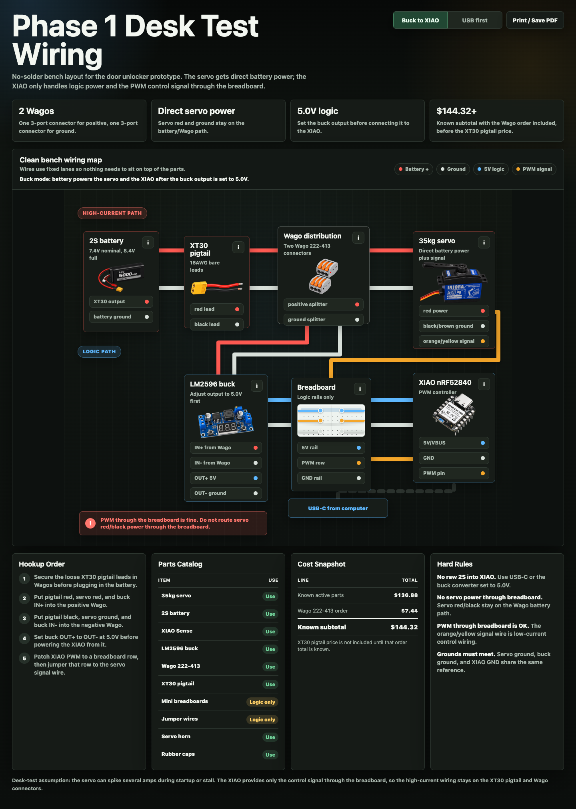

# Door Unlocker

Open-source desk-test prototype for a BLE-controlled servo actuator. The project uses a Seeed Studio XIAO nRF52840 Sense to drive a high-torque servo, plus SwiftUI iPhone and Mac apps for lock control, pairing, and controller administration.

Current release: `v0.2.1`, with iPhone/Mac app version `0.2.1` and controller firmware `0.1.26`.

This is a bench prototype and wiring reference, not a certified door lock, access-control system, or life-safety device.

## Stable Release Validation

The `v0.2.1` candidate was tested on July 11, 2026 against the bench XIAO controller and physical iPhone/Mac apps. It supersedes `v0.2.0`, which was promoted before later startup and multi-client stability problems were found. The current evidence and residual-risk assessment are in [the v0.2.1 release-readiness report](docs/release-readiness-v0.2.1.md).

Validation run:

- iPhone install path remains `script/install_ios_app.sh`, which builds for `generic/platform=iOS` and installs with `devicectl`.
- iPhone wireless debug/monitor path is documented in `docs/ios-wireless-debugging.md`; use `script/ios_device_status.sh --require-wireless` and `script/monitor_ios_app.sh --wireless-only` to prove the no-cable path.
- iPhone physical-device build/install passed with the bundled DFU package.
- Firmware `0.1.26` passed a trusted-iPhone OTA proof with a signed BLE entry command, no controller USB connection, bootloader validation, reboot, secure reconnection, and post-reboot BLE version verification in `86s`.
- Mac admin package build passed with `swift build --package-path mac/DoorUnlockerAdmin`.
- Mac admin build/run install path passed with `script/build_and_run.sh --install`.
- Full 24-step release campaign passed: 19 base quality gates, 121 shared tests, 19 Mac tests, 8 iOS adapter tests, firmware compile/package verification, both app builds, physical cold/warm launch proof, three live two-client hardware gates, both final app installations, persistence and per-subscriber delivery contracts, and all wiring/CAD model gates.
- Physical iPhone launch gate passed 10 cold and 10 warm samples: cold median `277.5 ms`, cold p95/max `315 ms`, warm median/p95 `0 ms` from scene activation to secure command readiness.
- Live release checks passed 10 repeated app relaunch cycles, 20 alternating iPhone/Mac commands, and 4 cross-client setting changes without a failed confirmation.
- Quality scores: maintainability `92.2/100`, shared parity `100/100`, iOS modularity `96.7/100`, and Mac modularity `98.4/100`.

The machine-readable physical proofs are in [docs/firmware-release-proof.json](docs/firmware-release-proof.json) and [docs/ios-launch-performance-last-run.json](docs/ios-launch-performance-last-run.json). Historical OTA tuning and benchmark details are kept in [docs/ota-speed-plan.md](docs/ota-speed-plan.md).

[View the Phase 1 wiring diagram](https://bt1142msstate.github.io/door-unlocker/)



## What Is Included

- XIAO nRF52840 Sense firmware for BLE control, authenticated commands, servo movement, and onboard LED state.
- SwiftUI iPhone app for connecting over BLE and toggling between locked and unlocked states.
- SwiftUI Mac admin app for USB-C controller management, Bluetooth lock/unlock, pairing approval, and trusted-device removal.
- Siri/App Shortcuts, WidgetKit home widget, and Control Widget support for iPhone Action Button controls.
- Interactive no-solder desk-test wiring diagram with hardware list, costs, and part details.
- Hardware notes for a battery-powered 2S setup using XT30 pigtails, compact inline lever splitters, a buck converter, and a breadboard.
- Phase 2 enclosure, mounting, fit, and force documentation in [`cad/`](cad/) and [`docs/`](docs/).
- An optimal component direction document for the lower-power enclosure path: [docs/optimal-components.md](docs/optimal-components.md).
- A documented, cross-platform low-latency control contract: [docs/fast-lock-command-path.md](docs/fast-lock-command-path.md).
- A calibrated full quality suite with iOS/Mac adapter parity tests and explicit evidence limits: [docs/quality-suite.md](docs/quality-suite.md).

## Hardware

Current Phase 1 desk-test parts:

- Seeed Studio XIAO nRF52840 Sense, pre-soldered.
- INJORA 35 kg high-torque digital servo.
- 25T metal servo arm with rubber end cap.
- 7.4 V 2S Li-ion battery with XT30 output.
- XT30 pigtails.
- LM2596 adjustable buck converter for the microcontroller rail.
- Two XALXMAW 1-in/2-out inline lever splitters: one for positive and one for common ground.
- Mini breadboard and jumper wires.

The servo power should come directly from the battery-side power split. The XIAO should be powered through the buck converter. The servo signal line can go through the breadboard because it is only carrying PWM signal, not servo motor current.

> **Power warning:** do not connect the XIAO's external buck-fed `5V` rail while USB-C is also powering the board. Disconnect USB-C before enabling the external controller rail, verify buck output with a meter first, and keep all grounds common.

The current LM2596 and no-solder wiring are prototype-friendly, not the final low-power target. The optimized hardware direction is to use one protected 2S pack, a low-quiescent 2S-capable buck for the controller rail, a true high-side servo power switch, switched battery measurement or a multi-cell fuel gauge, and protected 2S solar charging. See [docs/optimal-components.md](docs/optimal-components.md) for the current preferred component direction and source links.

With the XIAO component side facing up and the USB-C connector at the top:

- Servo signal uses XIAO `D2`: third pin down on the left side.
- Common ground uses XIAO `GND`: second pin down on the right side.
- Servo ground, battery negative, buck ground, and XIAO `GND` must all share the same ground reference.

## Repository Layout

```text
assets/                         Rendered hardware images used by the wiring page
firmware/DoorUnlockerXiao/       Arduino firmware for the XIAO nRF52840
ios/DoorUnlockerApp/             SwiftUI iPhone app, widget, and control extension
mac/DoorUnlockerAdmin/           SwiftUI Mac app with wireless and USB-C administration
shared/DoorUnlockerShared/       Cross-platform command, BLE policy, parser, signing, and DFU modules
cad/                            Parametric Phase 2 enclosure and mounting models
docs/                           Architecture, validation, power, fit, and force documentation
script/                         Build, install, firmware, simulation, and quality-gate tooling
screenshots/                     Project screenshots and visual references
phase-1-desk-test-wiring.html    Interactive desk-test wiring diagram
index.html                       GitHub Pages entry point
```

The iPhone and Mac apps share two Swift package products. `DoorUnlockerShared` owns the lock/unlock command model, secure wire-packet assembly, parser/models, safety limits, write/recovery decisions, controller-setting formatting, and control presentation policy. `DoorUnlockerDFU` owns the complete Nordic BLE firmware-update transport and progress/ETA model. Platform targets retain only platform integrations such as local signing-key storage, iOS background/proximity behavior, Mac USB serial administration, and native UI.

`script/score_shared_parity.py` prevents shared contracts from drifting back into app-specific copies, and the full quality suite compiles/tests the shared package, both platform adapters, and both apps.

## Quick Start

Requirements: macOS with Xcode, `arduino-cli`, the Seeed nRF52 board package, a physical iPhone for BLE testing, and the hardware listed above.

1. Clone the repository and connect the XIAO over USB-C.
2. Build and flash the controller with `./script/flash_xiao_uf2.sh`. Use `--build-only` when you only need release artifacts.
3. Put your Apple team ID in the ignored file `ios/DoorUnlockerApp/development-team.local`, or export `DEVELOPMENT_TEAM=<team-id>`.
4. Install the iPhone app with `./script/install_ios_app.sh`. Add `--wireless-only` after Xcode has enabled wireless device connectivity.
5. Install the Mac app and CLI with `./script/build_and_run.sh --install`.
6. Enable pairing from USB-C with `pair on`, or use an already trusted iPhone/Mac to open pairing wirelessly.
7. Request pairing on the new device, read its 4-digit code, and approve that code from an already trusted device or with `pair approve CODE` over USB serial.
8. Use the main toggle, Siri/App Shortcuts, widget, iOS Control, Action Button, Mac app, or local CLI after pairing completes.

The checked-in Apple signing settings are intentionally blank. Change bundle and App Group identifiers if you are distributing your own fork. Core Bluetooth hardware behavior cannot be validated in the iOS Simulator.

The iPhone and Mac apps each generate a separate P-256 signing identity. The iPhone prefers Secure Enclave and falls back to a Keychain-stored software key. The Mac stores its software key under Application Support with owner-only file permissions. The XIAO stores trusted public keys only, so the repository does not contain a shared command secret.

## Firmware Notes

The firmware advertises a BLE peripheral for the iPhone and Mac apps, stores up to four paired device public keys in internal flash, allows up to four simultaneous BLE central connections, verifies signed `v3` commands, drives the servo to locked or unlocked positions, and changes the XIAO LED color based on state.

Unlock commands hold the servo at the unlock angle for up to 30 seconds by default. The iPhone and Mac apps can set the controller timeout from 5-120 seconds, and the XIAO stores that value locally. After the configured timeout, the controller automatically returns to the locked/rest position to reduce battery drain and servo stress.

The controller can store an optional command timestamp with lock/unlock activity for future local history features. The current apps intentionally do not present an unlock-history panel.

Servo calibration is controller-owned. The default rest angle is `95` degrees and the default push angle is `20` degrees for the current arm setup, so unlock rotates the arm to the right. Apps and USB commands can set both values. Each angle is clamped to `10`-`170` degrees; equal or crossing values are allowed for calibration, although equal values produce no movement.

USB serial commands:

- `pair on`: enable BLE pairing requests.
- `pair approve CODE`: approve the pending device if the code matches the device being paired.
- `pair reject`: reject the pending device request.
- `pair off`: disable BLE pairing mode and clear any pending request.
- `pair status`: print pairing mode, pending request, and paired device count.
- `pairs list`: print paired device slots, fingerprints, and names when known.
- `pairs remove N`: remove one paired device by slot number.
- `pairs clear`: remove all paired devices.
- `app status`: print machine-readable model, state, pairing, timeout, servo-angle, and last-unlock status for the Mac admin app.
- `app pairs`: print machine-readable paired-device slots, fingerprints, counters, and names when known.
- `app lock [EPOCH_SECONDS]` / `app unlock [EPOCH_SECONDS]`: move the actuator and optionally save a command timestamp.
- `app angles REST PUSH`: set persisted servo rest and push angles, for example `app angles 95 20`.
- `app timeout SECONDS`: set the persisted 5-120 second auto-lock timeout.
- `app lock name NAME`: set the controller-owned lock name.
- `app rename SLOT_OR_FINGERPRINT NAME`: rename a trusted device.
- `app pair on` / `app pair off`: enable or disable USB-C pairing from the Mac admin app.
- `app approve CODE` / `app reject`: approve or reject a pending device request from the Mac admin app.
- `app remove N`: remove one paired device by slot number from the Mac admin app.
- `app lock` / `app unlock`: move the actuator from the Mac admin app over trusted USB.
- `app bootloader`: reboot the XIAO into UF2 bootloader mode for firmware updates.
- `app ota`: reboot into BLE OTA DFU mode for recovery/testing.
- `app cleanup untrusted`: disconnect currently untrusted BLE links.

LED states:

- Red: no trusted device can command the controller and USB pairing mode is locked.
- Purple: USB pairing mode is enabled and waiting for a device request.
- Cyan: a device pairing request is pending USB approval.
- Blue: locked.
- Green: unlocked.
- Yellow: servo is moving.

Servo angle defaults, safety limits, and timing constants are defined near the top of `firmware/DoorUnlockerXiao/DoorUnlockerXiao.ino`; the live angle values are stored on the controller after calibration.

## iPhone App Notes

The app provides:

- One main state toggle for Lock/Unlock.
- BLE connection management.
- Trusted-device pairing that sends only the new phone public key to the XIAO and requires typing the 4-digit code shown on the new phone into an already trusted iPhone/Mac or USB-C admin flow.
- Invite flow for adding a new iPhone: a trusted phone opens pairing mode, shares a non-secret `doorunlocker://pair` link, then approves the 4-digit code shown on the new device.
- Optional Face ID/passcode confirmation before sending unlock commands.
- Auto-lock timeout setting that is stored and enforced by the controller.
- Servo rest/push angle calibration stored and enforced by the controller.
- Editable controller-owned lock name shared across trusted devices and widgets.
- Editable iPhone display name that updates the trusted-device record without re-pairing.
- Optional proximity unlock with a location-based arming zone, precise-location support, configurable BLE RSSI trigger, feet/meters display, and an expanded direction map.
- Optional unlock notifications when the controller reports `unlocked` while the app is in the background.
- Siri/App Intents for voice and shortcut automation.
- A state-aware home screen widget and lock/unlock Live Activity with Dynamic Island presentation on supported iPhones.
- A Control Widget so the project can appear in iOS Controls and be assigned to the Action Button on supported iPhones.
- Original, monochrome, gold, aurora, pink, red, ember, and violet color themes.

## Mac App Notes

The Mac app is named **Door Unlocker**, matching the iPhone app. Its source package remains in `mac/DoorUnlockerAdmin` because it owns the additional trusted-device and USB-C administration features. It automatically connects to the XIAO over USB-C serial at 115200 baud when the controller is plugged in, trusts the Mac over that USB-C admin channel, and auto-connects over Bluetooth when wireless control is available.

- Show controller model, state, pairing mode, auto-lock timeout, live auto-lock countdown, and trusted-device count.
- List trusted devices by friendly name when known, plus slot and public-key fingerprint.
- Enable or disable pairing mode over trusted wireless control or USB-C.
- Approve or reject a pending device pairing request by typing the 4-digit code shown on the new device.
- Automatically trust the Mac over USB-C for wireless control.
- Remove one trusted device, clear all trusted devices, or send lock/unlock over USB.
- Set controller-owned auto-lock timeout and servo rest/push angles.
- Auto-connect over Bluetooth when available and use the same Lock/Unlock toggle as the iPhone app.
- Show controller firmware and connected-device state, and install the same BLE DFU package used by iPhone.
- Provide a local CLI for scripts and automation.

The Mac app does not display pending approval codes or pending public-key fingerprints. Device names are stored by the firmware for new pairings. Existing pairings made before this feature may show as `Device 1`, `Device 2`, and so on until that device is paired again.

`./script/build_and_run.sh --install` replaces the canonical local bundle at `~/Applications/Door Unlocker.app`. The installer preserves the existing trusted bundle identity and local data while removing the legacy `DoorUnlockerAdmin.app` bundle after the replacement verifies successfully.

iOS may hide the user-assigned system device name from apps, so the iPhone app keeps its own Door Unlocker display name. Updating that name sends an authenticated rename command to the controller; it does not require deleting or re-pairing the phone.

For background widget updates, the app stores each BLE state update in the shared app group and asks WidgetKit to reload the Door Unlocker widget. The app also enables the `bluetooth-central` background mode so iOS can wake it for controller BLE activity when allowed. iOS can still defer or skip background widget refreshes, especially if the app was force-quit, Background App Refresh is disabled, Bluetooth permission is denied, or Low Power Mode is limiting background work.

Run it locally with:

```sh
./script/build_and_run.sh
```

CLI examples:

```sh
cd mac/DoorUnlockerAdmin
swift run door-unlocker status
swift run door-unlocker lock
swift run door-unlocker unlock
swift run door-unlocker bootloader
```

## Firmware Update Process

`script/flash_xiao_uf2.sh --build-only` compiles the Arduino firmware and creates both update formats:

- `dist/DoorUnlockerXiao.uf2` for USB-C UF2 recovery flashing.
- `dist/DoorUnlockerXiao-dfu.zip` for BLE OTA DFU from the iPhone or Mac app.

The build script compiles the controller with `-Os` by default to keep OTA packages small without changing firmware behavior. Set `XIAO_OPTIMIZATION_FLAG=-Ofast` when running the script if you need to reproduce the stock Seeed board-package optimization setting.

For USB-C recovery or first-time flashing, use:

```sh
./script/flash_xiao_uf2.sh --port /dev/cu.usbmodem3101
```

When the installed firmware supports `app bootloader`, the script asks the running controller to reboot into UF2 bootloader mode, then copies the UF2 to `/Volumes/XIAO-SENSE`. If the installed firmware is too old to enter UF2 mode from USB-C, the script pauses for a one-time reset-button double press. The script uses `cp -X` when copying the UF2 so macOS does not add metadata files to the XIAO bootloader volume.

For app-driven OTA updates, the controller must already trust the app issuing the update command. The trusted app sends the signed `ENTER_OTA_DFU` command, the controller enters BLE DFU mode, the app uploads `DoorUnlockerXiao-dfu.zip`, then the controller reboots and the app verifies the reported firmware version. Both apps persist an update journal and, after relaunch, first reconcile normal firmware before probing DFU mode. Old normal firmware causes a clean restart, the expected firmware completes verification, and a reachable bootloader restarts the Legacy DFU transfer. USB-C remains the recovery fallback.

Firmware may be promoted to a release only after `python3 script/quality_suite.py --firmware-release` passes. In addition to the exact-package BLE proof, that mode requires proof that the recorded signed dual-bank bootloader is physically installed, rejects an unsigned image, and preserved a valid bank through power-loss tests. The structural contract gate also rejects a non-subscribable control characteristic and prevents the pre-DFU connection phase from being blocked as though DFU transport had already taken over.

The iPhone app also carries a bundled controller firmware version in `DoorControllerFirmwareVersion`. When the app connects, reads a known controller firmware version, and sees that the bundled firmware is newer, it can start the same secure OTA path automatically without a manual update button press. The app intentionally does not auto-update when the controller version is `Unknown` and does not downgrade a controller that reports a newer version than the bundled package.

Normal firmware updates should preserve the controller's stored pairings, lock name, timeout, and servo angles. Do not run `pairs clear`, delete trusted devices, or re-pair the iPhone just because an OTA or UF2 update was performed. Re-pair only when the app key was actually lost, such as after deleting/reinstalling the app or replacing the phone.

The controller keeps the servo signal attached while the lock is in the unlocked state so the arm can hold pressure on the handle until auto-lock or a manual lock command. After returning to the locked/rest angle, the firmware detaches the servo signal to reduce idle power draw and heat.

The current firmware `0.1.26` application payload is approximately `134 KB`. The latest clean trusted-iPhone proof on the installed legacy bootloader completed in `92s`; structured telemetry measured `82.68s` inside the DFU upload. The app logs scan, bootloader selection, progress buckets, current/average throughput, completion, and failure events under the `FirmwareUpdate` log category.

The current DFU tuning uses packet receipt notification parameter `8`. The configured object-preparation delay is ignored by Legacy DFU. The repository vendors NordicDFU `4.16.0` as an independent package with one documented Adafruit compatibility patch: Legacy DFU uses CoreBluetooth's negotiated write payload, capped at `244` bytes, instead of always forcing `20`. Existing bootloaders still report a `20`-byte limit; Adafruit `0.10+` can use the larger path. PRN `8` remains the highest value Adafruit documents as safe.

The speed research, bottleneck analysis, and next benchmark matrix live in [`docs/ota-speed-plan.md`](docs/ota-speed-plan.md). The stable apps share one DFU tuning model so iPhone and Mac updates use the same default path. For controlled iPhone benchmark runs, the verifier accepts debug-only launch overrides:

```sh
DFU_PRN=8 DFU_OBJECT_PREP_DELAY=0.3 ./script/verify_ios_ota.sh --wireless-only --target <new-version>
```

To compare the stable and candidate tuning paths repeatedly, run the matrix wrapper:

```sh
./script/benchmark_ios_ota_matrix.sh --target <new-version> --runs 3
```

If command-line iPhone signing needs your local Apple team, keep the repository settings blank and pass it only as an environment override:

```sh
DEVELOPMENT_TEAM=<team-id> ./script/benchmark_ios_ota_matrix.sh --target <new-version> --runs 3
```

For iPhone OTA testing, bundle the current DFU package at:

```text
ios/DoorUnlockerApp/DoorUnlocker/Firmware/DoorUnlockerXiao-dfu.zip
```

Then run the repeatable physical-device verifier:

```sh
./script/verify_ios_ota.sh --wireless-only --target 0.1.26
```

The wireless verifier installs the iPhone app, launches the bundled-firmware debug update flow, and waits for a version-specific iPhone Darwin notification that is posted only after the app receives `firmware_version:<target>` from the controller over BLE after DFU. With `--wireless-only`, the script refuses to start if the controller USB-C serial port is visible. The controller should not be plugged into USB-C for this proof; the iPhone can stay connected to the Mac for app installation and automation.

Each verifier run writes a persistent telemetry summary to `docs/ota-last-run.json` and detailed launch/notification logs under `docs/ota-telemetry/`. The success report includes the target firmware, elapsed seconds, package byte count, package hashes, whether it was wireless-only, and the exact Darwin notification that proved the app saw the post-update firmware version over BLE.

To terminate the iPhone app during a real upload and prove journal recovery, run a new-version wireless test such as:

```sh
RUN_ID=<run-id> INTERRUPT_AT_PROGRESS=30 \
  ./script/verify_ios_ota.sh --wireless-only --target <new-version>
```

The verifier kills the app process after observing the requested progress, relaunches it without debug update arguments, and only passes after a fresh BLE firmware-version notification. Use `script/summarize_ota_timing.py` to turn a captured app console log into structured timing JSON.

For Mac OTA testing, build the package and send it through the admin app/CLI flow:

```sh
./script/flash_xiao_uf2.sh --build-only
./script/build_and_run.sh --install
./dist/door-unlocker firmware-proof dist/DoorUnlockerXiao-dfu.zip 0.1.26
```

`firmware-proof` sends the update request to the running Mac app, waits for the app to receive the expected `firmware_version` over BLE after DFU, then prints `verified_over=ble`. Use plain `firmware ZIP_PATH` for an interactive app-driven update when you do not need an automated proof.

The XIAO bootloader is separate from Door Unlocker firmware. The repository now contains a public P-256 verification key and reproducible metadata for an Adafruit nRF52 bootloader `0.11.0` candidate built specifically for `xiao_nrf52840_ble_sense` with `DUALBANK_FW=1`, `SIGNED_FW=1`, and unsigned UF2 disabled. Its build gate also pins the high-throughput transport profile: ATT MTU `247`, DFU payloads up to `244` bytes, data-length extension, automatic 2 Mbps PHY negotiation, `15-30ms` connection intervals, connection-event extension, and accelerated flash writes. `script/build_secure_bootloader.sh` reproduces that candidate from the checked-in public key; the private key is not required to build or inspect the bootloader. The private key at `~/Library/Application Support/Door Unlocker/FirmwareSigning/firmware-signing-key.pem` is used only to sign application updates. Back it up securely; losing it prevents future signed updates to migrated controllers.

`script/flash_xiao_uf2.sh --build-only` signs the DFU application when the private key is present. `script/check_ota_bootloader_contract.py` cryptographically verifies the package against the checked-in public key. It also parses every block of the migration UF2 and rejects any image that touches the SoftDevice, application, or Door Unlocker data region. The candidate is **not** considered installed or production-proven until `docs/ota-bootloader-installed-proof.json` records the exact bootloader artifact hash plus physical rollback and unsigned-rejection results. Do not install the candidate without an attended USB-C/J-Link recovery path.

Prepare the candidate without modifying hardware using `script/install_secure_bootloader.sh`. The explicit `--install --confirm-jlink-recovery` mode copies the special one-time UF2 migration image only when the existing XIAO bootloader volume is mounted and the operator confirms an SWD unbrick path. Routine updates continue to use signed BLE DFU packages, not the migration image.

`./script/build_and_run.sh --install` also creates `dist/door-unlocker`, a local command-line tool:

```sh
./dist/door-unlocker status
./dist/door-unlocker unlock
./dist/door-unlocker lock
./dist/door-unlocker toggle
./dist/door-unlocker timeout 30
./dist/door-unlocker angles 95 20
./dist/door-unlocker pairs
./dist/door-unlocker rename 1 "My iPhone"
```

Use `./dist/door-unlocker --help` for the full command list. The CLI auto-detects the XIAO serial port by default and also accepts `--port /dev/cu.usbmodemXXXX`.
When the Mac app is already running, `lock`, `unlock`, `toggle`, `timeout`, and `angles` are handed to the app locally so the CLI does not compete with the app for the USB-C serial stream.

## Roadmap

- Controller/app usage stats: track values such as daily unlock counts and recent lock/unlock history. Keep this local-first and privacy-preserving, with the controller as the source of truth where practical.
- Per-device access roles: let owner/admin devices approve new devices wirelessly while standard trusted devices can only lock/unlock or use selected settings.
- Power-optimized hardware pass: replace prototype power modules with the optimal component stack documented in [docs/optimal-components.md](docs/optimal-components.md), then remeasure idle current, servo hold current, charge recovery, and enclosure heat.
- Matter/HomeKit evaluation after moving beyond the current BLE-only controller path.
- Universal handle/turn-button actuator support, tamper/weather improvements, and later camera-assisted installation guidance.

The complete phased hardware/product roadmap is maintained in the [interactive project page](https://bt1142msstate.github.io/door-unlocker/).

## Security And Safety

This project intentionally avoids publishing a command secret. The iPhone and Mac apps sign each wireless command with a locally generated private key, and the XIAO verifies the signature with the paired public key. Each accepted `v3` command also consumes a random, connection-private controller nonce, which prevents a captured command packet from being replayed.

The application protocol authenticates commands; it does not claim end-to-end confidentiality for BLE advertisements or shared state notifications. The current application package is signed by the project P-256 key, but bootloader enforcement remains unproven until the signed dual-bank candidate is physically installed and tested. Physical possession and USB-C remain a recovery/admin boundary, and this prototype has not received an external security audit.

BLE pairing is locked unless pairing mode is enabled by USB-C or by a signed command from an already trusted device. A new device can submit a pairing request only while pairing is open, and it is not trusted until an already trusted iPhone/Mac or USB-C operator approves the 4-digit code shown on the new device. Pairing mode turns itself off after approval. If every trusted app key is lost, connect over USB-C, send `pair on`, and pair a replacement device. Use `pairs remove N`, `app remove N`, or `pairs clear` over USB-C if you need to remove trusted devices. A future access-role model should separate owner/admin devices from standard lock/unlock-only devices.

For anything beyond desk testing, review the mechanical mount, fail-safe behavior, battery handling, apartment rules, fire-safety requirements, and lock/egress requirements before use.

## License

MIT License. See [LICENSE](LICENSE).
