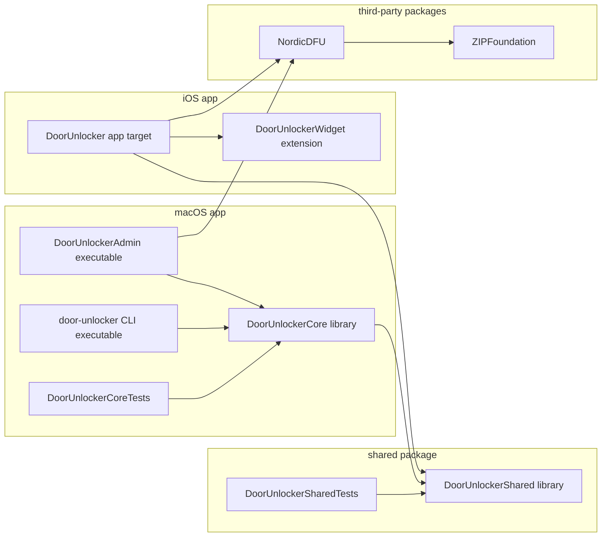

# Door Unlocker Dependency Graph

```mermaid
flowchart LR
    subgraph iOS["iOS app"]
        IOSApp["DoorUnlocker app target"]
        Widget["DoorUnlockerWidget extension"]
    end

    subgraph Mac["macOS app"]
        MacAdmin["DoorUnlockerAdmin executable"]
        MacCLI["door-unlocker CLI executable"]
        MacCore["DoorUnlockerCore library"]
        MacTests["DoorUnlockerCoreTests"]
    end

    subgraph Shared["shared package"]
        SharedLib["DoorUnlockerShared library"]
        SharedTests["DoorUnlockerSharedTests"]
    end

    subgraph ThirdParty["third-party packages"]
        Nordic["NordicDFU"]
        ZIP["ZIPFoundation"]
    end

    IOSApp --> Widget
    IOSApp --> SharedLib
    IOSApp --> Nordic
    MacAdmin --> MacCore
    MacAdmin --> Nordic
    MacCLI --> MacCore
    MacTests --> MacCore
    MacCore --> SharedLib
    SharedTests --> SharedLib
    Nordic --> ZIP
```
